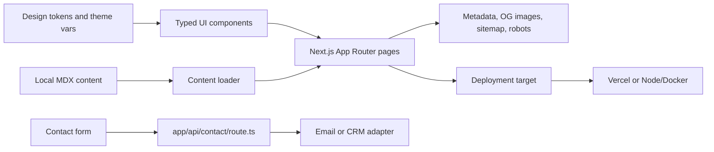
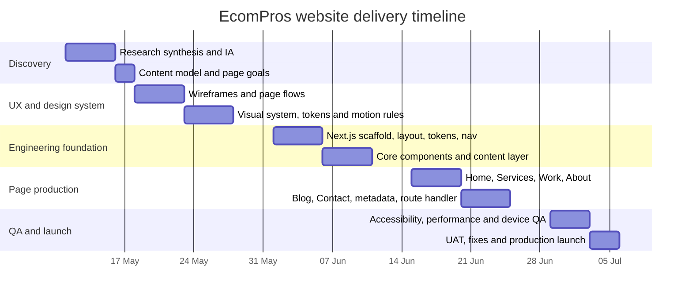

# EcomPros website strategy and implementation report

## Executive summary

The strongest direction for EcomPros is **structured minimalism**: calmer and more legible than urlDZ!NR Studioturn0search1, warmer and more expressive than a generic SaaS landing page, and less retail-driven than urlAppleturn0search0. Across the current official sites for urlAppleturn0search0, urlVercelturn1search0, urlLinearturn1search1, urlClayturn0search2, urlInstrumentturn2search0 and urlWork & Coturn2search1, the recurring pattern is a short global navigation, a high-clarity hero, immediate proof near the fold, modular content sections, and deeper case studies instead of long undifferentiated copy. citeturn16view0turn4view2turn4view3turn18view0turn4view6turn4view7

For EcomPros specifically, the site should present five service lines without fragmenting the message. The cleanest way to do that is to group them into three public-facing pillars on the homepage and top-level IA: **Websites**, **Products** and **Visual Systems**. Under those buckets, the full offer remains visible: website design and development; software design and development; mobile app development and design; motion design; and graphic design work in tools such as entity["software","Figma","collaborative design software"] for posters and social content. This grouping mirrors how peer agencies combine breadth with clarity: services are visible, but proof and work stay central. citeturn5view3turn5view4turn5view2turn13view1

The recommended visual language is a tokenised light/dark design system built around variable fonts, a 4px spacing base, a 12/8/4 responsive grid, and restrained motion that uses transform and opacity far more than heavy parallax. Accessibility should target WCAG 2.2 AA, with normal text contrast at or above 4.5:1, non-text UI contrast at or above 3:1, visible keyboard focus, and interaction targets never below the WCAG 2.2 AA minimum of 24×24 CSS pixels; for most buttons and icon controls, EcomPros should use an internal standard of 44×44 where layout permits. Reduced-motion preferences must be honoured. citeturn7search3turn6search4turn10search0turn10search5turn7search0turn14search0turn7search1

On the engineering side, the most pragmatic default is entity["software","Next.js","React framework"] App Router with entity["software","TypeScript","typed language for JavaScript development"], route handlers for the contact endpoint, built-in font optimisation with `next/font`, `Image` for media stability, the Metadata API for SEO and OG outputs, and MDX for blog and case-study content. Deploy first on urlVercelturn8search8 for the lowest-friction path, while keeping the codebase portable enough for a Node.js server or Docker deployment because official Next.js documentation supports those targets as well. citeturn6search3turn9search0turn7search3turn8search6turn8search7turn19search0turn8search1turn8search5

## Reference landscape

The references below prioritise official, current English-language sites. I have favoured sources that show how leading agencies and SaaS companies combine **calm hierarchy, premium motion, product credibility and proof density** without collapsing into either sterile minimalism or over-designed portfolio theatre. citeturn16view0turn4view1turn4view2turn4view3turn4view11turn13view1

### Visual and interaction references

| Official reference URL | Short note for EcomPros |
|---|---|
| urlapple.comturn0search0 | Stacked editorial homepage modules, split CTAs, disciplined image-led hierarchy, and sparse copy. Borrow the **section rhythm**, large visual hierarchy and CTA pattern; do **not** borrow the retail volume or product density. citeturn16view0 |
| urldzinrstudio.comturn0search1 | Video-first hero and explicit emphasis on energy, storytelling, motion and feeling. Borrow the **expressive confidence** and hero energy, but reduce the drama slightly for a broader B2B/B2C trust profile. citeturn4view1turn5view0 |
| urlclay.globalturn0search2 | Best reference for breadth: branding, digital products, websites, content and development all framed in one coherent system. Borrow the **service architecture** and “proof through case studies” approach. citeturn18view0turn5view3 |
| urlramotion.comturn0search3 | Combines brand, app, UX and web cred with visible outcomes, case studies and a learning-oriented blog. Borrow the **proof-heavy service mix** and clearer startup-facing language. citeturn17view0turn17view1turn17view2 |
| urlinstrument.comturn2search0 | Editorial layout with strong imagery and a clear bridge between brand, product and marketing. Borrow the **pacing** and the sense of premium competence. citeturn4view6turn5view4 |
| urlwork.coturn2search1 | Work-first structure with latest updates and case-study proof near the top. Borrow the **case-led credibility model** and news/work balance. citeturn4view7turn5view2 |
| urlfantasy.coturn2search2 | Cinematic typography and a simple three-capability framing. Borrow the **clarity of top-level narrative** and bold headline treatment. citeturn4view8 |
| urlcuberto.comturn2search3 | Strong motion and interaction style with a more playful edge. Borrow selective **micro-interaction ideas** and hover treatment, but avoid novelty-first motion. citeturn4view9 |
| urlvercel.comturn1search0 | Dark, technical polish with concise copy and developer-tool credibility. Borrow the **technical confidence** and crisp card/screenshot rhythm for software and product pages. citeturn4view2 |
| urllinear.appturn1search1 | One of the strongest examples of premium SaaS restraint: minimal copy, sharp framing, product-led visuals and speed-oriented language. Borrow the **restraint** and premium tone. citeturn4view3 |
| urlstripe.comturn1search2 | Dense but highly legible modular storytelling with layered product UI and strong conversion pathways. Borrow the **information compression** and modular card logic. citeturn4view4 |
| urlframer.comturn1search3 | Excellent reference for motion-forward marketing done with visible performance proof. Borrow the **animated product storytelling** and benchmark/proof callouts. citeturn4view5 |
| urlnotion.comturn3search1 | Calm, modular bento-like layout language with a clear visual hierarchy across screenshots. Borrow the **modular composition system** for service and feature clusters. citeturn4view10 |
| urlwebflow.comturn3search3 | Rich interaction density, segmented offer architecture, and explicit AI/growth framing. Borrow the **category segmentation** and conversion pathways, not the maximal interaction count. citeturn4view11 |
| urlpitch.comturn3search4 | On-brand product previews with crisp headline/copy structure. Borrow the **product mockup presentation** style for case studies and service previews. citeturn4view12 |
| urlbakkenbaeck.comturn12search1 | Strong reference for “strategy, design and code under one roof” without visual clutter. Borrow the **competence-first posture** and simple page order. citeturn13view1 |
| urlfocuslab.agencyturn12search0 | High B2B clarity, strong testimonial density and clear process framing. Borrow the **trust-building mid-page proof** and FAQ/contact posture. citeturn13view0 |

### Peer agency comparison

| Peer agency site | What is visibly emphasised | Strongest lesson for EcomPros | What to avoid copying literally |
|---|---|---|---|
| urlDZ!NR Studioturn0search1 | Motion, brand feeling, founder/team presence, emotionally charged hero. citeturn4view1turn5view0 | Use motion as a trust multiplier, not just decoration. | Overly stylised copy if EcomPros needs a more technical-first tone. |
| urlClayturn0search2 | One-stop breadth across brand, digital products, websites, content and development. citeturn18view0turn5view3 | Build a service IA that shows range **without** fragmenting the homepage. | Enterprise sprawl and too many equal-weight options in navigation. |
| urlRamotionturn0search3 | Outcomes, case studies, web/UX/brand categories and a substantial blog. citeturn17view0turn17view1turn17view2 | Put proof and outcomes on-page early; use articles as secondary credibility. | Generic “startup agency” phrases if they are not backed by proof. |
| urlInstrumentturn2search0 | Brand/product/marketing integration with premium editorial pacing. citeturn4view6turn5view4 | Let whitespace feel intentional and premium, not empty. | Under-explaining core offerings. |
| urlWork & Coturn2search1 | Work-first posture, news/updates, and deep credibility from real product launches. citeturn4view7turn5view2 | Lead with work before long process copy. | A homepage that is so case-led it becomes vague for first-time visitors. |
| urlFantasyturn2search2 | High-concept positioning and bold visual language. citeturn4view8 | EcomPros can use stronger display type and clearer capability framing. | Excess abstraction that hides what the company actually does. |
| urlCubertoturn2search3 | Expressive hover states, motion-rich UI, AI/product emphasis. citeturn4view9 | Use a small number of signature interactions to signal craft. | Making motion the main point of the site. |
| urlBakken & Bæckturn12search1 | Strategy, design and development presented as one integrated competency. citeturn13view1 | EcomPros should frame design and engineering as one delivery system. | Going so understated that motion/graphic capability disappears. |

The recurrent strategic conclusion is straightforward: **show breadth, but keep the story narrow**. Peer agencies mostly present work, capability and contact in that order; blogs and team pages are supporting layers, not the opening act. EcomPros should therefore lead with one clear promise, surface its best proof on the homepage, and use the blog and team sections to reinforce trust rather than introduce the brand. citeturn4view7turn13view1turn13view0turn17view2

## Design system proposal

The system below is designed to feel premium and technical without becoming cold. It assumes a **light and dark theme**, uses variable fonts loaded through `next/font`, and treats accessibility as a system rule rather than as a later QA pass. `next/font` self-hosts fonts and removes external font requests, which helps privacy, performance and layout stability. WCAG guidance should drive minimum contrast, focus visibility and target sizes, while reduced motion should be respected by default when users request it. citeturn7search3turn6search4turn10search0turn10search5turn7search0turn7search1

### Typographic and spatial system

For typography, I recommend a dual-sans system:

| Token | Specification | Use |
|---|---|---|
| `font-display` | Instrument Sans Variable, 600–700 | Hero, large headings, section titles |
| `font-body` | Inter Variable, 400–600 | Body copy, UI labels, cards, form labels |
| `font-mono` | ui-monospace, SFMono-Regular, Menlo, monospace | Metrics, code snippets, tiny technical labels |

The intended type scale is:

| Role | Size | Line height | Weight | Notes |
|---|---:|---:|---:|---|
| Display XL | 72px | 76px | 700 | Home hero desktop only |
| Display L | 56px | 62px | 700 | Hero, featured case studies |
| Heading XL | 40px | 48px | 650 | Section intros |
| Heading L | 32px | 40px | 650 | Inner page heroes |
| Heading M | 24px | 32px | 600 | Card titles, sub-sections |
| Body L | 18px | 30px | 450 | Primary paragraph text |
| Body M | 16px | 28px | 450 | Default UI/body |
| Body S | 14px | 22px | 500 | Metadata, chips, labels |
| Caption | 12px | 18px | 500 | Tiny hints only; avoid for dense copy |

This should be accompanied by a **4px base spacing scale**:

`4, 8, 12, 16, 24, 32, 40, 48, 64, 80, 96, 128`

For layout, use:

| Breakpoint | Grid | Margins | Gutter | Max content width |
|---|---|---:|---:|---:|
| Mobile | 4 columns | 16px | 16px | 100% |
| Tablet | 8 columns | 24px | 20px | 100% |
| Desktop | 12 columns | 32px | 24px | 1280px |
| Wide desktop | 12 columns | 40px | 24px | 1360px on selected portfolio pages only |

Key spatial rules should remain consistent across the site:

- body copy measure: **64–72 characters**
- section padding desktop: **96–128px**
- section padding tablet: **72–96px**
- section padding mobile: **56–72px**
- card corner radius: **20px**
- input/button corner radius: **14–16px**
- surface border width: **1px**
- focus ring: **2px outline plus 2px offset**

### Iconography, imagery and motion

Iconography should feel more like a product system than a poster system: 20px and 24px icons, 1.75–2px stroke, mildly rounded joins, with filled icons reserved for status or emphasis. Do not mix three different icon families. If a third-party set is used, keep it monochrome by default and drive colour through surrounding chips or badges rather than multi-colour icons.

Imagery should follow three rules. First, prefer **framed product visuals**: browser shots, dashboard crops, app screens, motion stills, or typographic brand assets. Second, use **abstract supporting visuals** only when they reinforce the service story, not as filler. Third, never allow stock photography to dominate the experience; if people are shown, they should be contextual and sparse.

Motion should be deliberate, not omnipresent. The clearest principle for EcomPros is: **one signature motion idea per section, not five**. Recommended timing tokens:

| Motion token | Duration | Use |
|---|---:|---|
| `motion-fast` | 120ms | Button hover, chip states |
| `motion-base` | 180ms | Card hover/focus |
| `motion-medium` | 240ms | Drawer, tabs, accordions |
| `motion-slow` | 320ms | Section reveal, hero media shift |
| `motion-xslow` | 480ms | Large hero transitions only |

Recommended easing values:

- standard: `cubic-bezier(0.2, 0.8, 0.2, 1)`
- entrance: `cubic-bezier(0.16, 1, 0.3, 1)`
- exit: `cubic-bezier(0.4, 0, 1, 1)`

Motion rules:

- animate **opacity** and **transform** first
- avoid layout-thrashing width/height animation where possible
- no automatic carousels without a pause control
- any decorative loop must degrade to a still poster when reduced motion is requested
- hover should never be the only way to reveal meaning or controls

These rules align with user motion preferences and accessible interaction practice. citeturn7search1turn10search5turn7search0

### Colour tokens including logo backgrounds

EcomPros should avoid the overused “pure black + electric blue everywhere” startup palette. The better fit is a **deep neutral base with restrained cobalt and violet accents**, allowing the site to look technical, professional and motion-aware without feeling generic.

#### Core semantic colour tokens

| Token | Light mode | Dark mode | Recommended pairing | Calculated contrast |
|---|---|---|---|---:|
| `bg-canvas` | `#F7F9FC` / `rgba(247, 249, 252, 1)` | `#08111F` / `rgba(8, 17, 31, 1)` | with primary text | n/a |
| `bg-surface` | `#FFFFFF` / `rgba(255, 255, 255, 1)` | `#0E1628` / `rgba(14, 22, 40, 1)` | with primary text | n/a |
| `bg-elevated` | `#EEF2F7` / `rgba(238, 242, 247, 1)` | `#13203A` / `rgba(19, 32, 58, 1)` | with muted text | n/a |
| `text-primary` | `#0B1220` / `rgba(11, 18, 32, 1)` | `#F5F7FA` / `rgba(245, 247, 250, 1)` | on `bg-surface` | 18.72:1 light / 16.81:1 dark |
| `text-secondary` | `#445066` / `rgba(68, 80, 102, 1)` | `#C5CEDA` / `rgba(197, 206, 218, 1)` | on `bg-surface` | 8.12:1 light / 11.35:1 dark |
| `text-muted` | `#5E6C84` / `rgba(94, 108, 132, 1)` | `#94A3B8` / `rgba(148, 163, 184, 1)` | on elevated surfaces | 4.72:1 light / 6.32:1 dark |
| `action-primary-bg` | `#3558D8` / `rgba(53, 88, 216, 1)` | `#3558D8` / `rgba(53, 88, 216, 1)` | with white label | 5.93:1 |
| `action-primary-hover` | `#2F4FC7` / `rgba(47, 79, 199, 1)` | `#2F4FC7` / `rgba(47, 79, 199, 1)` | with white label | 6.85:1 |
| `accent-blue` | `#4F7CFF` / `rgba(79, 124, 255, 1)` | `#7DA2FF` / `rgba(125, 162, 255, 1)` | on neutral surfaces | use for highlights, not small text |
| `accent-violet` | `#7A5CFF` / `rgba(122, 92, 255, 1)` | `#9A84FF` / `rgba(154, 132, 255, 1)` | decorative gradient stops | n/a |
| `focus-ring` | `#3558D8` / `rgba(53, 88, 216, 1)` | `#7DA2FF` / `rgba(125, 162, 255, 1)` | against page background | 5.93:1 light / 7.64:1 dark |

Text and interface colours should continue to follow WCAG thresholds: 4.5:1 for normal text, 3:1 for non-text UI such as controls and meaningful icons, with visible focus states on all keyboard-operable controls. citeturn6search4turn10search0turn10search5

#### L1, L2 and L3 logo background tokens

I am treating **L1 / L2 / L3** as three controlled background tiers for the EcomPros logo plate, favicon container, hero brand chip, or section-level brand lock-up. Each tier is usable in both light and dark themes and is paired with a recommended foreground logo colour.

| Logo token | Light mode background | Recommended light foreground | Contrast | Dark mode background | Recommended dark foreground | Contrast |
|---|---|---|---:|---|---|---:|
| `logo-bg-l1` | `#F7F9FC` / `rgba(247, 249, 252, 1)` | `#0B1220` / `rgba(11, 18, 32, 1)` | 17.75:1 | `#08111F` / `rgba(8, 17, 31, 1)` | `#F5F7FA` / `rgba(245, 247, 250, 1)` | 17.62:1 |
| `logo-bg-l2` | `#ECF2FF` / `rgba(236, 242, 255, 1)` | `#0B1220` / `rgba(11, 18, 32, 1)` | 16.68:1 | `#0E1A33` / `rgba(14, 26, 51, 1)` | `#F5F7FA` / `rgba(245, 247, 250, 1)` | 16.11:1 |
| `logo-bg-l3` | `#E2EBFF` / `rgba(226, 235, 255, 1)` | `#0B1220` / `rgba(11, 18, 32, 1)` | 15.66:1 | `#13244A` / `rgba(19, 36, 74, 1)` | `#F5F7FA` / `rgba(245, 247, 250, 1)` | 14.19:1 |

Recommended usage:

- **L1** for document-like or corporate placements
- **L2** for elevated cards, navigation badges and case-study labels
- **L3** for hero lock-ups, callout surfaces and selected motion frames

## Components and page architecture

The site should behave like a modern marketing system rather than a loose page collection. That means one semantic H1 per page, consistent landmark structure, pointer targets sized for touch, keyboard-visible focus, and no essential information hidden behind hover or animation. Tag filters, accordions, drawers and cards should all remain usable with keyboard, touch and reduced-motion settings. citeturn10search5turn7search0turn14search0turn7search1

### Layout patterns

| Pattern | Recommended structure | Responsive behaviour | Accessibility considerations |
|---|---|---|---|
| Hero | 6/6 or 5/7 split: left copy + CTAs, right media panel or logo plate | Collapse to single column on tablet/mobile; CTAs stack on narrow screens | One H1 only; if media auto-plays, keep muted, looped, pausable and replace with still under reduced motion |
| Services | 3-card or 6-card grid grouped into Websites / Products / Visual Systems | 3 cols desktop, 2 cols tablet, 1 col mobile | Cards must have full keyboard focus treatment; never rely on hover-only detail |
| Case studies | Featured alternating blocks followed by compact grid | Alternating layout becomes stacked blocks on tablet/mobile | Cards should be `<article>`-like structures with clear title, client and “View case study” target |
| Team | Compact credibility section on homepage; fuller grid on About page | 4 cols desktop, 2 cols tablet, 1 col mobile | Portraits need meaningful alt text only if informative; otherwise decorative rules apply |
| Contact | Contact hero, form, response-time note, optional FAQ | Two-column desktop, stacked mobile | Label every field, show inline errors plus summary, use `aria-live` for submission state |
| Blog | Featured article plus card grid and tag filter | 3 cols desktop, 2 cols tablet, 1 col mobile | Filters must be buttons/tabs with clear state; articles need semantic dates and headings |

### Component list with props and variants

| Component | Key props | Variants |
|---|---|---|
| `Container` | `size`, `as`, `className` | `default`, `narrow`, `wide`, `fullBleed` |
| `Section` | `id`, `as`, `padding`, `tone` | `default`, `subtle`, `inverse`, `accented` |
| `SectionHeader` | `eyebrow`, `title`, `body`, `align`, `cta` | `left`, `centre`, `split` |
| `Button` | `variant`, `size`, `href`, `icon`, `disabled`, `ariaLabel` | `primary`, `secondary`, `ghost`, `text` |
| `ThemeToggle` | `initialTheme`, `storageKey` | `iconOnly`, `labelled` |
| `HeroSection` | `title`, `body`, `primaryCta`, `secondaryCta`, `media`, `logoLevel` | `split`, `centre`, `caseStudy` |
| `ServiceCard` | `title`, `summary`, `slug`, `icon`, `capabilities`, `accent` | `default`, `featured`, `compact` |
| `CaseStudyCard` | `client`, `title`, `summary`, `outcomes`, `image`, `href`, `featured` | `featured`, `standard`, `minimal` |
| `MetricStrip` | `items`, `align`, `showDividers` | `compact`, `expanded` |
| `LogoCloud` | `logos`, `mono`, `scroll` | `static`, `marquee`, `grid` |
| `TestimonialCard` | `quote`, `author`, `role`, `company`, `avatar` | `quoteOnly`, `withAvatar` |
| `TeamCard` | `name`, `role`, `bio`, `photo`, `socials` | `compact`, `profile` |
| `BlogCard` | `title`, `excerpt`, `date`, `readingTime`, `tags`, `image`, `href` | `featured`, `default`, `compact` |
| `TagFilterBar` | `tags`, `activeTag`, `onChange` | `pill`, `underline` |
| `ContactForm` | `onSubmit`, `loading`, `successState`, `serviceOptions` | `default`, `compact` |
| `FAQAccordion` | `items`, `allowMultiple`, `defaultOpen` | `bordered`, `minimal` |
| `RichTextProse` | `content`, `withToc`, `lead` | `blog`, `caseStudy`, `policy` |
| `MediaFrame` | `src`, `alt`, `ratio`, `caption`, `priority` | `browser`, `device`, `plain` |

### Component-to-page mapping for Next.js and TypeScript

| Route | Suggested file | Primary components |
|---|---|---|
| Home | `app/page.tsx` | `HeroSection`, `LogoCloud`, `ServiceCard`, `CaseStudyCard`, `MetricStrip`, `TestimonialCard`, `BlogCard`, `CTASection` |
| Services | `app/services/page.tsx` | `HeroSection`, `SectionHeader`, `ServiceCard`, `FAQAccordion`, `CTASection` |
| Service detail | `app/services/[slug]/page.tsx` | `HeroSection`, `RichTextProse`, `MetricStrip`, `CaseStudyCard`, `CTASection` |
| Work | `app/work/page.tsx` | `SectionHeader`, `TagFilterBar`, `CaseStudyCard`, `CTASection` |
| Case study detail | `app/work/[slug]/page.tsx` | `HeroSection`, `MetricStrip`, `RichTextProse`, `MediaFrame`, `CaseStudyCard` |
| About | `app/about/page.tsx` | `HeroSection`, `MetricStrip`, `TeamCard`, `FAQAccordion`, `CTASection` |
| Blog | `app/blog/page.tsx` | `HeroSection`, `TagFilterBar`, `BlogCard`, `Pagination` |
| Blog article | `app/blog/[slug]/page.tsx` | `RichTextProse`, `MediaFrame`, `TagFilterBar`, `BlogCard` |
| Contact | `app/contact/page.tsx` | `HeroSection`, `ContactForm`, `FAQAccordion`, `CTASection` |

## Codex prompt pack

The prompts below assume entity["software","Next.js","React framework"] App Router with entity["software","TypeScript","typed language for JavaScript development"]. They also assume semantic HTML, role-based tests where applicable, and automated accessibility checks. **There is no specific styling constraint**: if the repository already uses CSS Modules, Styled Components or Tailwind, Codex should preserve that choice and keep the styling approach consistent rather than mixing paradigms. The prompts rely on official guidance for App Router, route handlers, metadata and role-based testing, plus automated a11y support in Storybook. citeturn6search3turn9search0turn8search7turn10search3turn11search3

### Shared foundation and section prompts

| ID | Precise Codex prompt | Expected file names | Acceptance criteria |
|---|---|---|---|
| F1 | Create the global app shell for the EcomPros marketing site using App Router and TypeScript. Add a root layout, skip link, metadata defaults, and semantic header/main/footer landmarks. Use the repository’s existing styling approach; if none exists, choose one consistent approach. Add smoke tests for layout rendering. | `app/layout.tsx`, `app/not-found.tsx`, `components/layout/SiteShell.tsx`, `tests/layout.test.tsx` | Skip link is visible on focus; one `main` landmark exists; no TypeScript or lint errors; tests pass. |
| F2 | Implement design tokens for light/dark themes using CSS variables that can be consumed by CSS Modules, Styled Components or Tailwind. Include EcomPros logo surface tokens `logo-bg-l1/l2/l3`, text colours, focus ring and spacing tokens. Add a theme toggle component with persisted user preference and system-theme fallback. | `styles/tokens.css`, `components/ui/ThemeToggle.tsx`, `lib/theme.ts`, `tests/theme-toggle.test.tsx` | Theme persists via local storage; DOM gets a deterministic theme attribute/class; toggle is keyboard accessible with `aria-label` and `aria-pressed`; token names are documented. |
| F3 | Create typography and prose primitives for headings, body text, eyebrow labels, metadata text and rich article prose. Use variable fonts and ensure responsive type sizing. Add tests verifying heading levels and accessible text rendering. | `components/ui/Typography.tsx`, `components/ui/Prose.tsx`, `tests/typography.test.tsx` | No skipped heading hierarchy inside examples; text renders responsively; prose styles work for blog and case-study content. |
| F4 | Build layout primitives for `Container`, `Section`, `Stack`, `Cluster` and `Grid` with typed props. Support mobile, tablet and desktop spacing presets that map to the design system. | `components/ui/Container.tsx`, `components/ui/Section.tsx`, `components/ui/Stack.tsx`, `components/ui/Cluster.tsx`, `components/ui/Grid.tsx`, `tests/layout-primitives.test.tsx` | Primitives accept typed props; spacing presets are token-based; examples render correctly across breakpoints. |
| F5 | Generate reusable `Button`, `TextLink`, `Badge` and `IconButton` components with typed variants and accessible states. Ensure focus styles, disabled states and icon-only labelling are implemented. | `components/ui/Button.tsx`, `components/ui/TextLink.tsx`, `components/ui/Badge.tsx`, `components/ui/IconButton.tsx`, `tests/button.test.tsx` | Icons-only buttons require `aria-label`; primary/secondary/ghost/text variants exist; focus states are visible in both themes. |
| F6 | Create the EcomPros site header with desktop navigation, active-link styling, mobile drawer navigation and a theme toggle slot. Navigation should include Home, Services, Work, About, Blog and Contact. Add tests for keyboard navigation and drawer open/close behaviour. | `components/layout/SiteHeader.tsx`, `components/layout/MobileNav.tsx`, `tests/site-header.test.tsx` | Drawer traps focus while open; ESC closes the drawer; active route is indicated; touch targets are generous. |
| F7 | Create the site footer and a reusable CTA band above it. Footer must include navigation repeats, contact CTA, and legal placeholders, with a calm premium layout. | `components/layout/SiteFooter.tsx`, `components/sections/CTABand.tsx`, `tests/site-footer.test.tsx` | Footer uses semantic lists/nav; CTA band supports custom copy and CTA props; layout collapses cleanly on mobile. |
| F8 | Build a flexible hero section component for EcomPros with support for split layout, centred layout and case-study hero layout. The component must accept an optional media panel, optional metrics row and optional logo background level. | `components/sections/HeroSection.tsx`, `tests/hero-section.test.tsx` | Exactly one H1 is rendered per page usage; CTA group supports one or two actions; media has accessible alt or is marked decorative. |
| F9 | Generate `ServiceCard` and `ServicesGrid` components for the three public-facing capability buckets and the five underlying service lines. Cards should support short summaries, capability bullets and optional accent icons. | `components/sections/ServiceCard.tsx`, `components/sections/ServicesGrid.tsx`, `tests/services-grid.test.tsx` | Cards are fully keyboard reachable; hover enhancements are not required to access core information; grid shifts 3→2→1 columns. |
| F10 | Build a proof module set: `LogoCloud`, `MetricStrip` and `TestimonialCard`, designed to be used on the homepage and service detail pages. Add role-based tests and sensible empty states. | `components/sections/LogoCloud.tsx`, `components/sections/MetricStrip.tsx`, `components/sections/TestimonialCard.tsx`, `tests/proof-modules.test.tsx` | Logo cloud can render in monochrome mode; metrics accept typed data; testimonials expose the quote text semantically. |
| F11 | Create `CaseStudyCard`, `FeaturedCaseStudies` and a compact case-study grid. Support featured, standard and minimal card variants with image, title, services used and outcomes. | `components/sections/CaseStudyCard.tsx`, `components/sections/FeaturedCaseStudies.tsx`, `tests/case-study-card.test.tsx` | Cards render as accessible articles/links; featured variant supports larger image ratios; no layout shift on image load. |
| F12 | Create `TeamCard` and `TeamGrid` components for a compact trust-building team section and a fuller About page section. Social links should be optional and hidden if absent. | `components/sections/TeamCard.tsx`, `components/sections/TeamGrid.tsx`, `tests/team-grid.test.tsx` | Photos have sensible alt behaviour; grid is responsive; empty social arrays do not render empty containers. |
| F13 | Create `BlogCard`, `TagFilterBar` and `Pagination` components for the blog index. Support featured and compact article cards and a filter state that works via keyboard and URL query params. | `components/sections/BlogCard.tsx`, `components/sections/TagFilterBar.tsx`, `components/ui/Pagination.tsx`, `tests/blog-components.test.tsx` | Filter state is reflected in URL search params; buttons expose pressed/selected state; pagination is keyboard-operable. |
| F14 | Build an accessible contact form component set with `Field`, `TextInput`, `TextArea`, `Select`, `FormError` and `ContactForm`. Include inline validation UI, consent copy slot, and progressive enhancement for submission state. | `components/forms/Field.tsx`, `components/forms/TextInput.tsx`, `components/forms/TextArea.tsx`, `components/forms/Select.tsx`, `components/forms/FormError.tsx`, `components/forms/ContactForm.tsx`, `tests/contact-form.test.tsx` | Every control has a programmatic label; errors are associated via `aria-describedby`; status messages use `aria-live`; submit button exposes loading state. |

### Pages, content and delivery prompts

| ID | Precise Codex prompt | Expected file names | Acceptance criteria |
|---|---|---|---|
| P1 | Create a typed content layer for service pages, case studies and blog posts. Use local MDX or typed data objects so the site can launch without a CMS. Add frontmatter/types for slug, title, excerpt, tags, reading time, hero image and SEO fields. | `content/services/*.mdx`, `content/work/*.mdx`, `content/blog/*.mdx`, `lib/content.ts`, `types/content.ts`, `tests/content-loader.test.ts` | Content loader returns typed entities; invalid frontmatter fails clearly; blog, service and work entries can be listed and fetched by slug. |
| P2 | Build the EcomPros homepage using the shared components: hero, proof strip, grouped services, featured case studies, process or approach section, blog teaser and final CTA. Keep the page premium, concise and motion-aware. | `app/page.tsx`, `tests/home-page.test.tsx` | One H1 only; sections render in the agreed order; page is responsive and accessible; no unused placeholder lorem in final component output. |
| P3 | Create the Services index page with a strong intro, grouped capabilities, FAQs and CTA. Use the three grouped pillars but expose all five service lines within the page. | `app/services/page.tsx`, `tests/services-page.test.tsx` | Page explains all five services clearly; service cards link to detail routes; FAQ accordion is keyboard accessible. |
| P4 | Generate a dynamic service detail route that renders a service-specific hero, deliverables, process, related case studies and CTA. Use static params from the content layer when possible. | `app/services/[slug]/page.tsx`, `app/services/[slug]/loading.tsx`, `tests/service-detail-page.test.tsx` | Unknown slug returns not-found; page metadata changes by slug; related case-study cards render when available. |
| P5 | Create the Work index page with a filterable case-study grid and an optional featured story at the top. Support filtering by service category or industry through URL params. | `app/work/page.tsx`, `tests/work-page.test.tsx` | Filtering updates the UI and the URL; card grid remains accessible; featured story is optional. |
| P6 | Build the dynamic case-study detail route with hero, client summary, scope, outcome metrics, narrative sections, media frames and related work. Keep the article structure scan-friendly and semantic. | `app/work/[slug]/page.tsx`, `components/sections/MediaFrame.tsx`, `tests/work-detail-page.test.tsx` | Page has semantic article structure; images include alt text or decorative handling; related work excludes the current case study. |
| P7 | Create the About page with brand story, operating principles, selected team members and a CTA to start a project. Keep it concise and credible rather than overly autobiographical. | `app/about/page.tsx`, `tests/about-page.test.tsx` | One H1; team section is optional-safe; page uses proof, not vague manifesto copy only. |
| P8 | Build the Blog index page using the content layer, including a featured article, tag filter and pagination. Add empty-state handling and stable sorting by date. | `app/blog/page.tsx`, `tests/blog-index-page.test.tsx` | Articles sort predictably; featured article does not duplicate in the grid unless intentionally configured; filter + pagination combination works. |
| P9 | Create the blog article route with MDX rendering, article metadata, optional table of contents, related posts and social/image block support. Add article-level metadata output. | `app/blog/[slug]/page.tsx`, `mdx-components.tsx`, `tests/blog-article-page.test.tsx` | MDX renders safely; heading structure is preserved; article metadata is typed; related posts exclude the current article. |
| P10 | Build the Contact page with contact hero, form, response expectation note, optional FAQ and map/details placeholder. Reuse the contact form component and connect it to the route handler. | `app/contact/page.tsx`, `tests/contact-page.test.tsx` | Submit action is wired; page remains usable without JavaScript fallback messaging; errors and success states are communicated accessibly. |
| P11 | Implement an App Router contact route handler that accepts POST requests, validates payloads server-side, blocks bots with a honeypot field, and returns typed JSON responses. Keep the outbound email/CRM implementation behind an adapter interface. | `app/api/contact/route.ts`, `lib/contact-schema.ts`, `lib/contact-adapter.ts`, `tests/contact-route.test.ts` | Invalid payload returns 400/422; honeypot returns a safe success-like response; handler never exposes secrets to the client. |
| P12 | Add marketing-grade metadata and discovery files: per-page `generateMetadata`, Open Graph/Twitter defaults, `robots.ts`, `sitemap.ts`, and JSON-LD helpers for Organization, Service and Article schemas. | `lib/metadata.ts`, `lib/schema.ts`, `app/robots.ts`, `app/sitemap.ts`, `tests/metadata.test.ts` | Every major route has metadata; sitemap includes canonical public URLs; OG fields can be overridden per page; schemas are typed. |
| P13 | Set up the project test and review stack: Vitest unit tests, Testing Library helpers, Playwright smoke flows for key routes, and Storybook stories plus a11y checks for core components. Include one example story and one example E2E test. | `vitest.config.ts`, `playwright.config.ts`, `.storybook/*`, `tests/e2e/home.spec.ts`, `components/**/*.stories.tsx` | `npm` script entries are documented; one unit, one story and one E2E example pass; a11y addon is enabled for Storybook stories. |

## Engineering setup

The build should stay close to platform defaults: use the urlNext.js App Router docsturn6search3, implement server endpoints through urlRoute Handlersturn9search0, load fonts via urlnext/fontturn7search3, use the urlImage componentturn8search2 and image optimisation guidance citeturn8search6, and define SEO/share metadata through the urlMetadata APIturn8search7. For content, local MDX is a sensible first release because official Next.js documentation supports MDX in the App Router content model. citeturn19search0turn19search5

### Recommended folder structure

```text
app/
  layout.tsx
  page.tsx
  not-found.tsx
  robots.ts
  sitemap.ts
  about/
    page.tsx
  blog/
    page.tsx
    [slug]/
      page.tsx
  contact/
    page.tsx
  services/
    page.tsx
    [slug]/
      page.tsx
  work/
    page.tsx
    [slug]/
      page.tsx
  api/
    contact/
      route.ts

components/
  forms/
    ContactForm.tsx
    Field.tsx
    TextInput.tsx
    TextArea.tsx
    Select.tsx
  layout/
    SiteHeader.tsx
    MobileNav.tsx
    SiteFooter.tsx
    SiteShell.tsx
  sections/
    HeroSection.tsx
    ServicesGrid.tsx
    ServiceCard.tsx
    FeaturedCaseStudies.tsx
    CaseStudyCard.tsx
    TeamGrid.tsx
    TeamCard.tsx
    LogoCloud.tsx
    MetricStrip.tsx
    TestimonialCard.tsx
    BlogCard.tsx
    TagFilterBar.tsx
    CTABand.tsx
    MediaFrame.tsx
  ui/
    Button.tsx
    Badge.tsx
    IconButton.tsx
    ThemeToggle.tsx
    Container.tsx
    Section.tsx
    Grid.tsx
    Stack.tsx
    Cluster.tsx
    Typography.tsx
    Prose.tsx
    Pagination.tsx

content/
  blog/
  services/
  work/

lib/
  content.ts
  metadata.ts
  schema.ts
  theme.ts
  contact-schema.ts
  contact-adapter.ts
  utils.ts

styles/
  globals.css
  tokens.css

types/
  content.ts
  ui.ts

tests/
  unit/
  integration/
  e2e/
```

The architecture below keeps content, components, tokens and server endpoints separate without over-engineering the codebase.



### Build, deploy and tooling notes

For build and hosting, default to urlVercel for Next.jsturn8search8 because it is the native platform and has the smoothest preview deployment path. Keep the app portable, though: official Next.js documentation explicitly supports deployment as a Node.js server, a Docker container, or a static export where feature constraints allow. Static export is therefore fine for a pure brochure build, but the moment EcomPros wants route handlers, richer dynamic previews, or more complex server-side behaviour, Node or Vercel is the better fit. citeturn8search1turn8search5

For media, optimise stills through the Next Image pipeline and keep homepage motion assets lightweight. If hero video is used, prefer short loops under a few megabytes, provide poster images, and do not block the main content on media load. For SEO, wire metadata per route, emit sitemap and robots files, and add JSON-LD for Organisation, Service and Article entities. citeturn8search6turn8search7turn8search10

### Suggested development dependencies

| Category | Suggested packages | Why |
|---|---|---|
| Quality | urlESLintturn11search2, Prettier, `lint-staged`, Husky | Keep formatting and linting consistent before merge |
| Unit/component tests | urlVitestturn11search1, `@testing-library/react`, `@testing-library/user-event`, `jest-axe` | Fast developer feedback and accessible component checks |
| E2E tests | urlPlaywrightturn11search4 | Smoke-test the main public routes and form submission |
| Component review | urlStorybook a11y addonturn11search3, `@storybook/react` | Review components in isolation and catch a11y regressions earlier |
| Forms and validation | `react-hook-form`, `zod` | Typed client/server validation with minimal ceremony |
| Content | `@next/mdx`, `gray-matter` or typed content config | Keep blog and case studies file-based in the first release |
| Utilities | `clsx`, `class-variance-authority`, `lucide-react` | Clean variant handling and consistent icon usage |

If starting from zero, I would favour **CSS variables plus either CSS Modules or Tailwind**, but not both. The important constraint is consistency: one token system, one styling strategy, one component naming scheme.

### Example snippets

The theme-switching example below is intentionally agnostic: the same token strategy works with CSS Modules, Styled Components or Tailwind because the theme source of truth is the root `data-theme` attribute.

```tsx
// components/ui/ThemeToggle.tsx
'use client';

import { useEffect, useState } from 'react';

type Theme = 'light' | 'dark';

export function ThemeToggle() {
  const [theme, setTheme] = useState<Theme>('light');

  useEffect(() => {
    const stored = localStorage.getItem('theme') as Theme | null;
    const systemPrefersDark = window.matchMedia('(prefers-color-scheme: dark)').matches;
    const resolved = stored ?? (systemPrefersDark ? 'dark' : 'light');

    document.documentElement.dataset.theme = resolved;
    setTheme(resolved);
  }, []);

  function toggleTheme() {
    const next: Theme = theme === 'dark' ? 'light' : 'dark';
    document.documentElement.dataset.theme = next;
    localStorage.setItem('theme', next);
    setTheme(next);
  }

  return (
    <button
      type="button"
      onClick={toggleTheme}
      aria-pressed={theme === 'dark'}
      aria-label={`Switch to ${theme === 'dark' ? 'light' : 'dark'} mode`}
    >
      {theme === 'dark' ? 'Light mode' : 'Dark mode'}
    </button>
  );
}
```

```css
/* styles/tokens.css */
:root {
  --logo-fg: #0B1220;
  --logo-bg-l1: #F7F9FC;
  --logo-bg-l2: #ECF2FF;
  --logo-bg-l3: #E2EBFF;
}

[data-theme='dark'] {
  --logo-fg: #F5F7FA;
  --logo-bg-l1: #08111F;
  --logo-bg-l2: #0E1A33;
  --logo-bg-l3: #13244A;
}

.logo-plate {
  color: var(--logo-fg);
  border: 1px solid rgba(255, 255, 255, 0.08);
  border-radius: 20px;
}

.logo-plate[data-level='l1'] { background: var(--logo-bg-l1); }
.logo-plate[data-level='l2'] { background: var(--logo-bg-l2); }
.logo-plate[data-level='l3'] { background: var(--logo-bg-l3); }
```

## Delivery plan

The schedule below assumes a **seven-week implementation window** beginning on **Monday 11 May 2026**. It is aggressive but realistic for a focused team handling strategy, design and build in parallel.

### Timeline



### Milestones and deliverables

| Phase window | Milestone | Deliverables | Exit criteria |
|---|---|---|---|
| 11–15 May 2026 | Strategy alignment | Final IA, page inventory, reference board, content requirements | Stakeholders agree on sitemap and grouped service model |
| 18–29 May 2026 | Design system locked | Wireframes, token set, type scale, grid, motion rules, dark/light direction | No open decisions on spacing, type, colour or hierarchy |
| 1–12 June 2026 | Engineering foundation | App shell, theme system, navigation, shared sections, content loader | Core components stable and reusable |
| 15–26 June 2026 | Page build complete | Home, Services, Work, About, Blog, Contact, metadata, contact API | All public pages built and connected to real content |
| 29 June–3 July 2026 | QA sign-off | Accessibility pass, responsive checks, performance pass, copy fixes | WCAG AA issues triaged/resolved, Lighthouse and manual QA acceptable |
| 6–7 July 2026 | Launch | Production deploy, redirects, analytics handover, support checklist | Site live, rollback plan documented, team handoff completed |

A practical milestone rule is this: **do not start polish before tokens and components are stable**. On agency websites, late-stage rework usually comes from unclear component rules, not from missing animations. If EcomPros locks the design system in week two and keeps copy tightly mapped to components, the build stays efficient and the final site will look intentional rather than assembled.